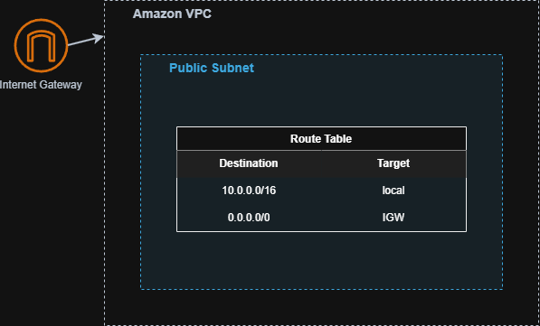
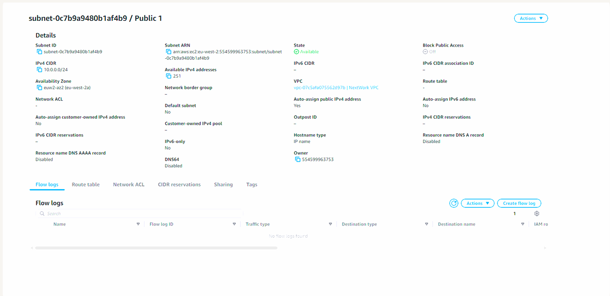
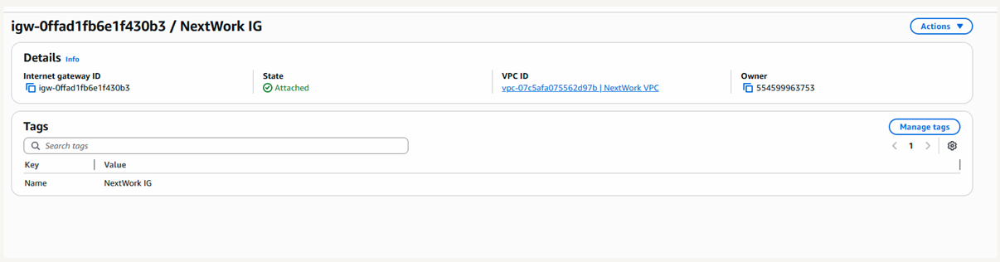
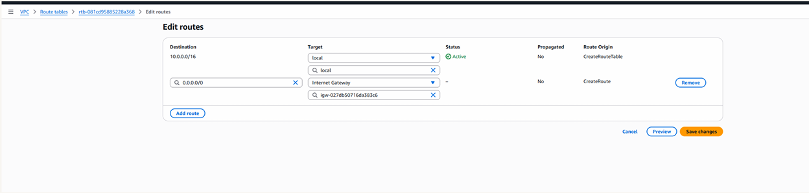

# AWS VPC Foundations

## Overview

This project demonstrates how to build a custom Amazon Virtual Private Cloud (VPC) from scratch.  
The goal was to understand the fundamental components of AWS networking including IP addressing, subnet design, and internet connectivity.

---

## Architecture

The VPC acts as an isolated network environment where cloud resources can be deployed securely.

---

## Implementation Steps

### Create a Custom VPC
A VPC was created with a defined IPv4 CIDR block to provide a private address range for cloud resources.

### Create a Subnet
A subnet was created within the VPC to host compute resources.

### Configure Internet Access
An Internet Gateway was attached to the VPC to enable internet connectivity.

### Update Route Tables
The route table was configured with the following route:
Destination: 0.0.0.0/0
Target: Internet Gateway

This allows resources in the subnet to communicate with the internet.

---

## Skills Demonstrated

AWS VPC configuration  
Subnet design  
Internet Gateway configuration  
Route table management  
Cloud networking fundamentals

---

## Screenshots

### VPC Creation

### Subnet Configuration

### Internet Gateway

### Route Table Configuration

