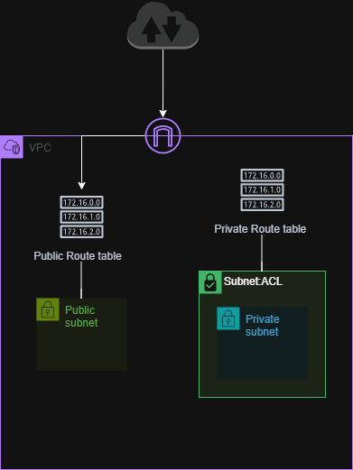
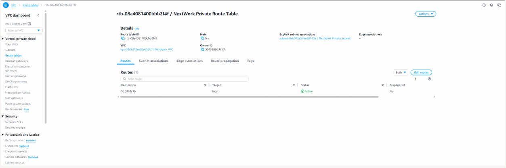
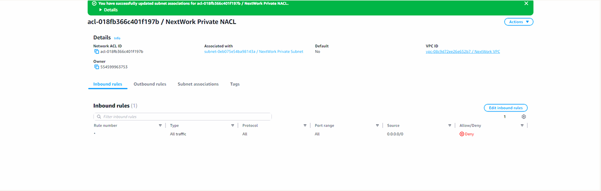

# Public vs Private Subnets in AWS (Private Subnet Build)

## Overview
This project demonstrates how to design a VPC with **public and private subnet separation**.  
The focus is on keeping private resources isolated by controlling routing and applying subnet-level security.

---

## Architecture

The architecture consists of a single VPC with two subnets designed to demonstrate network segmentation and traffic control.

- **Public subnet** – associated with a route table that allows internet-bound traffic through an Internet Gateway.
- **Private subnet** – associated with a separate route table that does not route traffic to the Internet Gateway.
- **Network ACL** – applied to the private subnet to enforce additional subnet-level security rules.

---

## Implementation Steps

### Create a Private Subnet
Created a new private subnet within the existing VPC using a different CIDR block from the public subnet.

### Create a Dedicated Private Route Table
Created a new route table because the default route table was configured to route to the Internet Gateway.
The private route table was kept local-only, preventing direct internet exposure.

### Create a Dedicated Network ACL
Created a custom Network ACL for the private subnet to avoid the default “allow all” behavior.
Configured the NACL with simple restrictive rules (deny inbound and outbound by default).

---

### Skills Demonstrated

- VPC subnet design (public vs private)
- Route table association and traffic control
- Network ACLs (subnet-level stateless firewall)
- Secure network segmentation

---

## Screenshots

### Private Subnet Configuration

### Private Route Table

### Network ACL Rules
