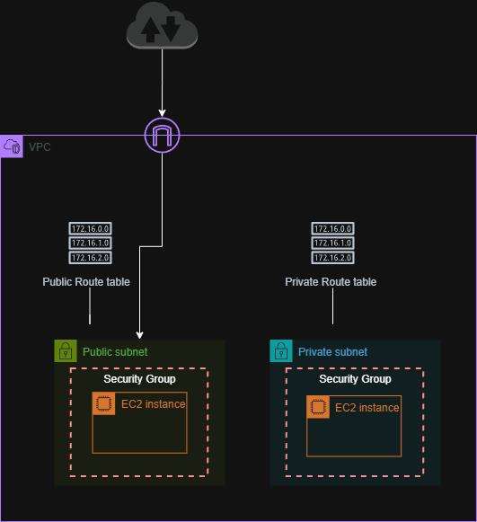
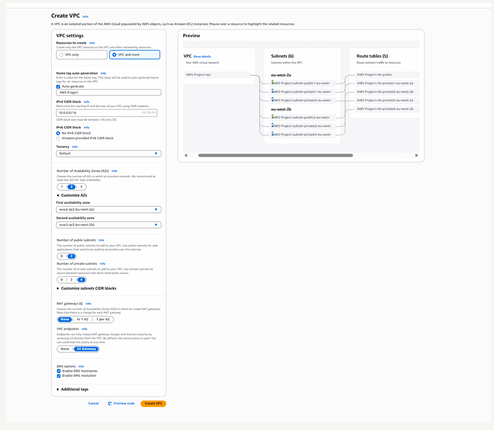
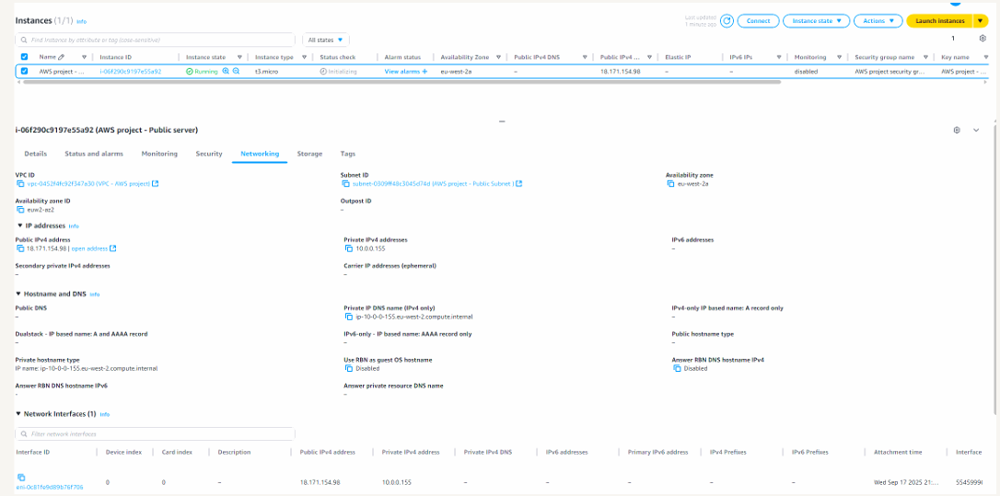
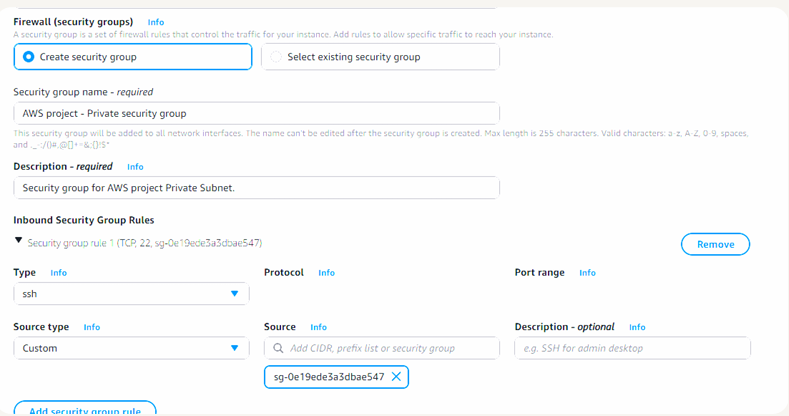

# EC2 Deployment in Public and Private Subnets

## Overview
This project demonstrates how to launch EC2 instances in both public and private subnets within an Amazon VPC.

The goal was to understand how subnet placement affects access, how security groups differ for public and private resources, and how AWS tools such as key pairs and the VPC resource map simplify deployment.

---

## Architecture

The architecture consists of a single VPC with both public and private subnets.

- **Public subnet** – hosts an EC2 instance that can be accessed directly from the internet through an Internet Gateway.
- **Private subnet** – hosts an EC2 instance that is isolated from direct internet access.
- **Security groups** – configured separately to control traffic to the public and private instances.
- **Key pair** – created to allow secure SSH access to the EC2 instance.
- **VPC resource map** – used through the **VPC and more** workflow to visualise the deployed infrastructure.

The following diagram illustrates the deployment of EC2 instances across public and private subnets within the VPC.

---

## Implementation Steps

### Create a Key Pair
Created a key pair in `.pem` format to securely authenticate to the EC2 instance.

### Launch a Public EC2 Instance
Deployed an EC2 instance into the public subnet and configured its networking settings so it used the custom VPC environment.

### Launch a Private EC2 Instance
Deployed a second EC2 instance into the private subnet with a dedicated security group to restrict access and prevent direct internet connectivity.

### Configure Security Groups
Used separate security groups for the public and private instances to reflect different access requirements.

### Use the VPC and More Workflow
Used the **VPC and more** option to create the VPC, subnets, route tables, and Internet Gateway more efficiently while using the AWS resource map to visualise the architecture.

---

## Skills Demonstrated
- EC2 deployment in public and private subnets
- SSH key pair usage
- Security group configuration
- Public vs private workload placement
- AWS VPC resource map usage
- Cloud network architecture design

---

## Screenshots

### VPC Creation Using "VPC and More"

### Public EC2 Instance

### Private Security Group
