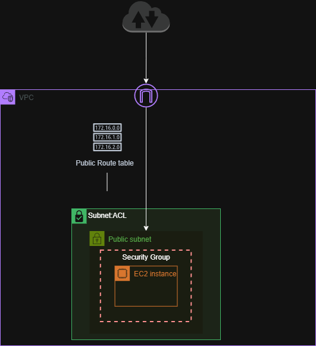
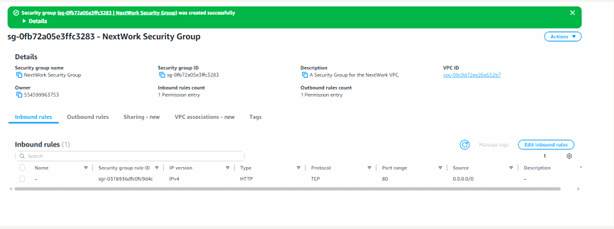
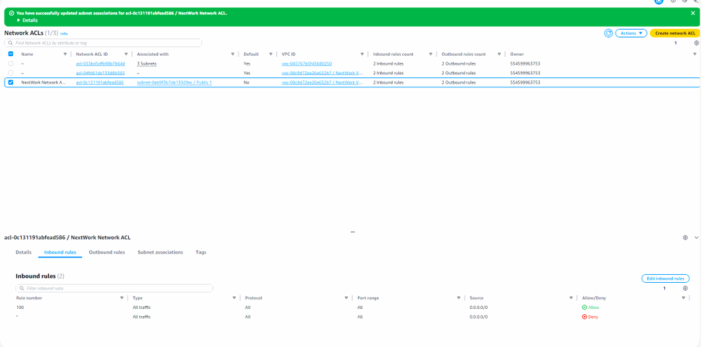

# Network Security in AWS VPC
## Overview

This project demonstrates how AWS network security controls regulate traffic within a Virtual Private Cloud (VPC).

The focus is on understanding how **Security Groups** and **Network ACLs** operate at different layers of the network to control traffic and enforce security boundaries.

Security Groups function as **instance-level firewalls**, while Network ACLs act as **subnet-level firewalls**, providing a layered security model within the VPC.

---

## Architecture

The architecture consists of a VPC containing an EC2 instance protected by two layers of network security controls.

Traffic entering the subnet is filtered by a **Network ACL**, while traffic reaching the EC2 instance is filtered by a **Security Group**.

- **Security Groups** – control inbound and outbound traffic at the instance level.
- **Network ACLs** – control traffic entering and leaving the subnet.

Together they provide layered traffic filtering within the VPC.

---

## Implementation Steps

### Create a Security Group

Created a security group for the EC2 instance and configured inbound rules to allow specific traffic such as HTTP.

### Configure Security Group Rules

Added inbound rules defining which ports and sources were allowed to communicate with the instance.

### Configure a Network ACL

Configured a Network ACL for the subnet to filter traffic entering and leaving the subnet.

### Apply Layered Network Security

### Apply Layered Network Security

Verified that both the Security Group and Network ACL enforced traffic rules correctly, demonstrating how AWS applies security controls at both the instance and subnet levels.
---

## Skills Demonstrated

- Security Group configuration
- Network ACL configuration
- Layered network security
- Instance-level vs subnet-level firewall rules
- Traffic filtering in AWS

---

## Screenshots

## Screenshots

The following screenshots show the configuration of the Security Group and Network ACL rules used to enforce layered network security.

### Security Group Rules

### Network ACL Rules
