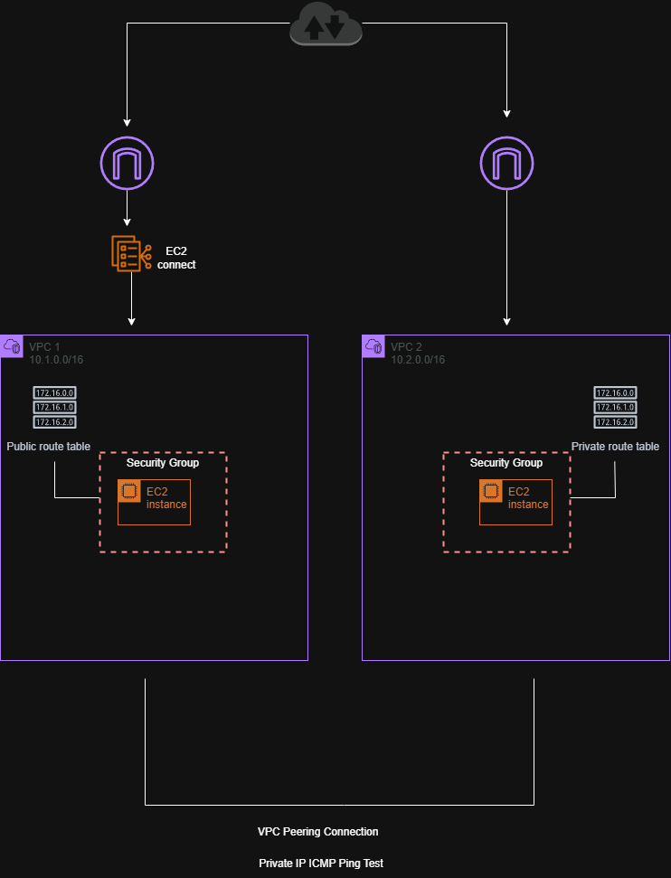
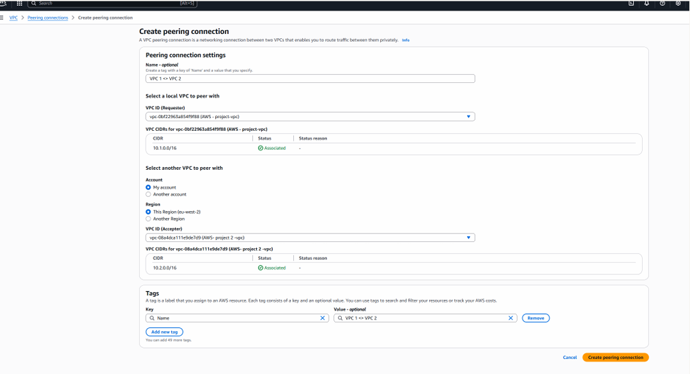
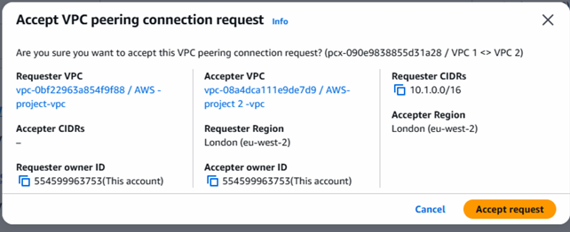
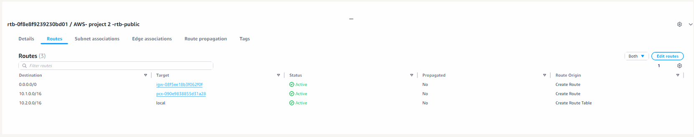
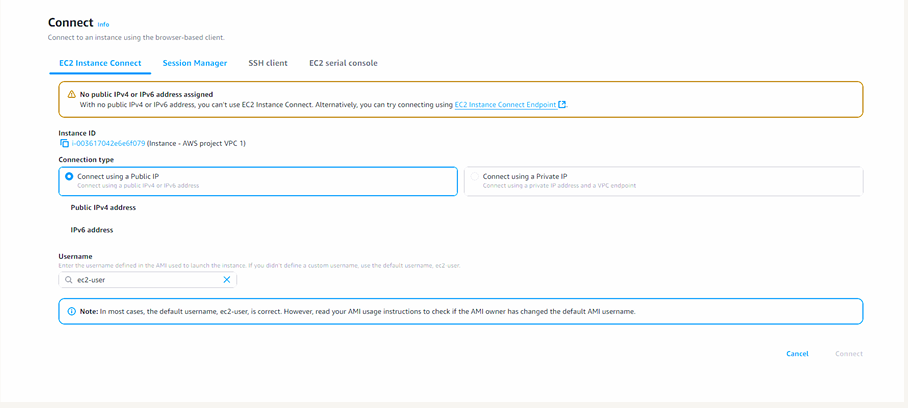
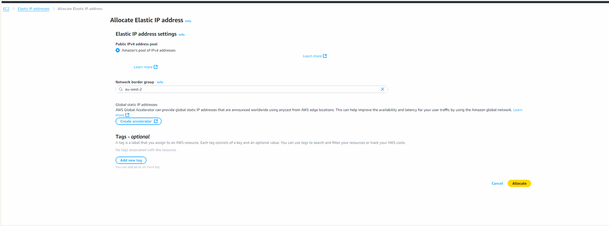
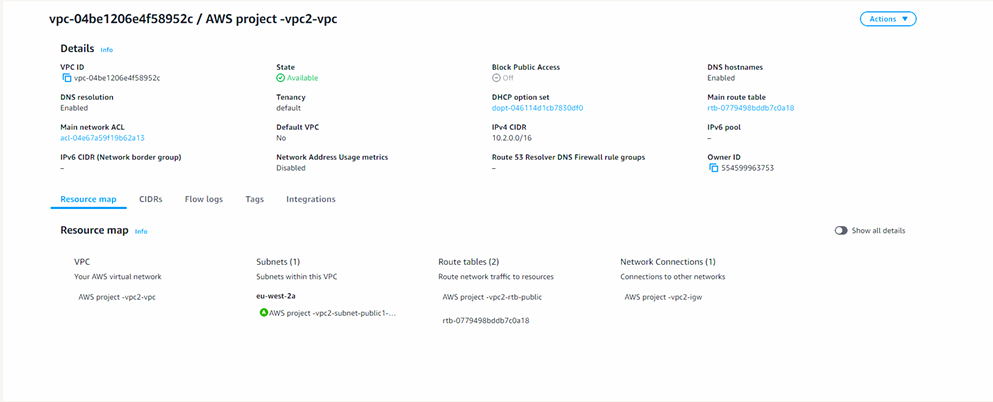

# AWS VPC Peering

## Overview

This project demonstrates how to establish private network connectivity between two Amazon Virtual Private Clouds (VPCs) using **VPC Peering**.

VPC peering allows resources in separate VPC networks to communicate using private IP addresses without routing traffic over the public internet.

The objective of this project was to create a peering connection between two VPC environments, configure route tables to allow traffic between the networks, and verify connectivity between instances.

During testing, a connectivity issue was encountered when attempting to connect to an EC2 instance. This was resolved by allocating an **Elastic IP (static public IPv4 address)** to enable external access.

---

## Architecture

The architecture consists of two independent VPC environments connected through a **VPC Peering connection**.

Each VPC contains its own CIDR block and routing configuration. Communication between the networks was enabled by creating a peering connection and updating route tables to route traffic between the VPC CIDR ranges.

---

## Implementation Steps

### Create Two VPC Environments

Two separate VPCs were created, each with its own CIDR block and networking configuration.

### Create a VPC Peering Connection

A VPC peering connection was created to establish private connectivity between the two VPC environments.

### Accept the Peering Request

The receiving VPC accepted the peering request to activate the connection between the networks.

### Update Route Tables

Route tables in both VPCs were updated so that traffic destined for the other VPC’s CIDR block was routed through the peering connection.

### Troubleshoot EC2 Connectivity

While attempting to connect to the EC2 instance using **EC2 Instance Connect**, an error occurred because the instance did not have a public IPv4 address assigned.

Without a public IP address, the instance could not be accessed directly from the internet.

### Allocate a Static Public IP (Elastic IP)

To resolve the issue, an **Elastic IP address** was allocated and associated with the EC2 instance. This provided a persistent public IPv4 address that allowed the instance to be accessed externally.

### Verify Connectivity Between VPCs

Connectivity between instances in the two VPC environments was verified using **ping tests between private IP addresses**, confirming that the VPC peering connection and route table configuration were functioning correctly.

---

## Skills Demonstrated

- VPC peering configuration
- Multi-VPC networking architecture
- Route table configuration
- Elastic IP allocation
- Troubleshooting EC2 connectivity
- Private cross-VPC communication
- AWS network architecture design

---

## Screenshots

### Creating the VPC Peering Connection

### Accepting the Peering Request

### Updating Route Tables

### EC2 Instance Connect Error

### Allocating a Static Public IP

### Connectivity Test Between VPCs

### VPC Resource Map
