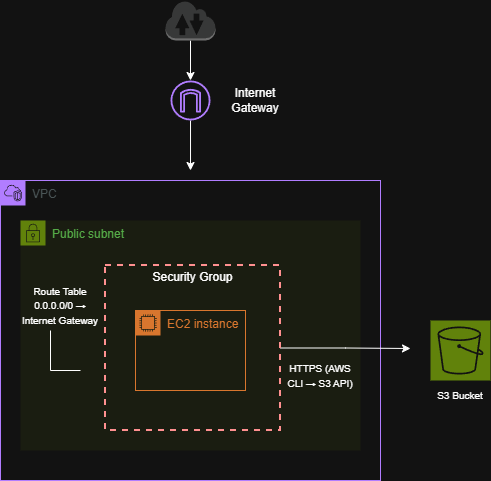
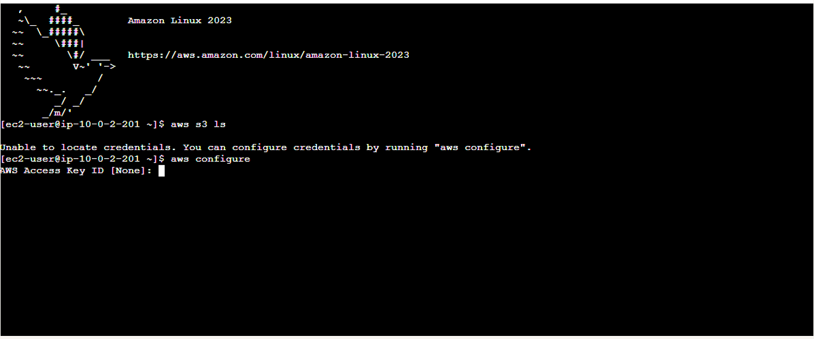
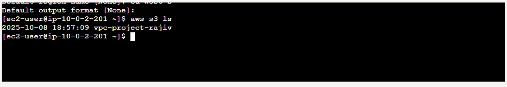
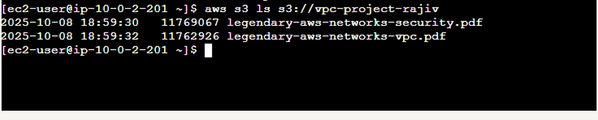
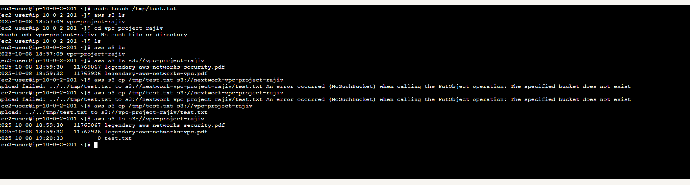

# Accessing Amazon S3 from an EC2 Instance

## Overview

This project demonstrates how to connect an EC2 instance to Amazon S3 using the AWS CLI.

The objective was to understand how an EC2 instance authenticates with AWS, interacts with S3 buckets, and performs operations such as listing and uploading objects.

The project also highlights the difference between **manual credential configuration using access keys** and the **best-practice approach of using IAM roles**.

---

## Architecture

The architecture consists of:

- **Amazon VPC**
- **Public subnet**
- **EC2 instance**
- **Amazon S3 bucket**
- **AWS CLI authentication**

The EC2 instance communicates with S3 using the AWS CLI over the internet.



---

## Implementation Steps

### Launch the EC2 Instance

An EC2 instance was launched inside a public subnet within the VPC.

### Create an S3 Bucket

An S3 bucket was created and populated with files for testing access.

### Attempt S3 Access (Initial Failure)

An attempt was made to list S3 buckets using:

```bash
aws s3 ls
````

This failed with:

```
Unable to locate credentials
```

This demonstrated that the EC2 instance had **no authentication configured**.

### Configure AWS CLI

The AWS CLI was configured using:

```bash
aws configure
```

Credentials were provided using:

* Access Key ID
* Secret Access Key
* Default region

### Verify S3 Access

After configuring credentials, the EC2 instance successfully listed available buckets:

```bash
aws s3 ls
```

### View Bucket Contents

The contents of the S3 bucket were listed:

```bash
aws s3 ls s3://vpc-project-rajiv
```

### Upload an Object to S3

A test file was created and uploaded:

```bash
touch /tmp/test.txt
aws s3 cp /tmp/test.txt s3://vpc-project-rajiv
```

The upload was verified by listing the bucket contents again.

---

## Skills Demonstrated

* EC2 to S3 connectivity
* AWS CLI configuration
* Debugging authentication issues
* S3 bucket interaction (list, upload)
* Understanding access keys vs IAM roles
* Cloud storage integration from compute services

---

## Screenshots

### Missing Credentials Error



### Listing S3 Buckets



### Viewing Bucket Contents



### Uploading File and Verification

This screenshot shows both the successful upload using the AWS CLI and the confirmation that the file exists in the S3 bucket.

