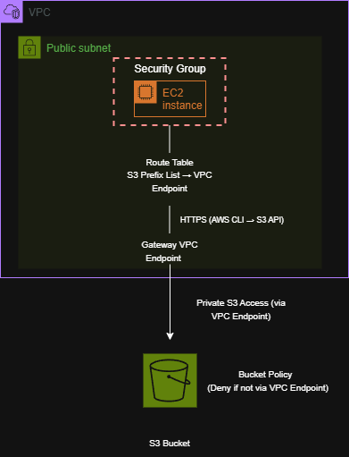
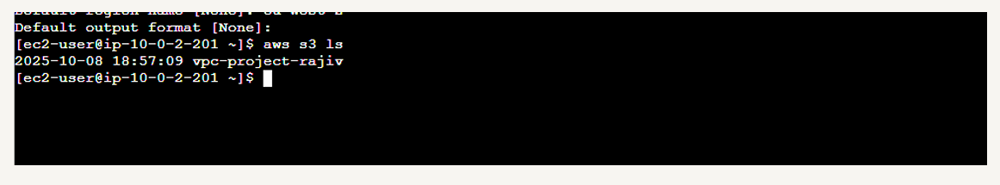
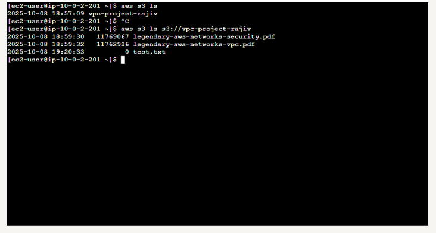
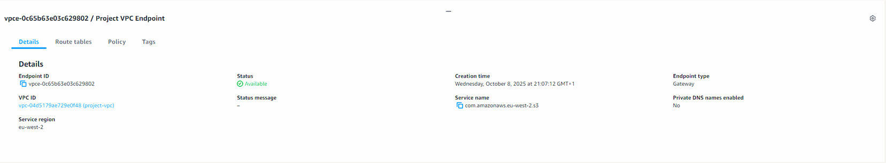
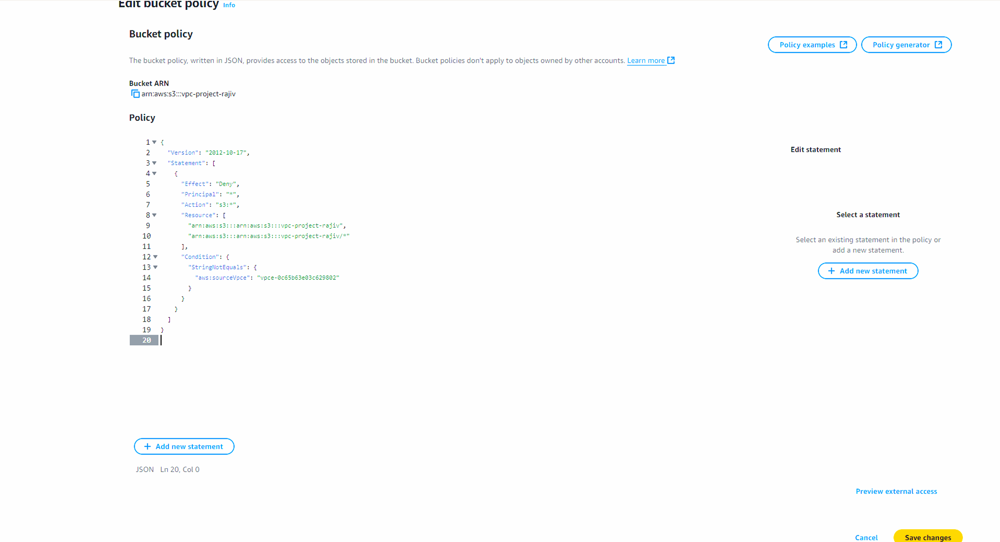
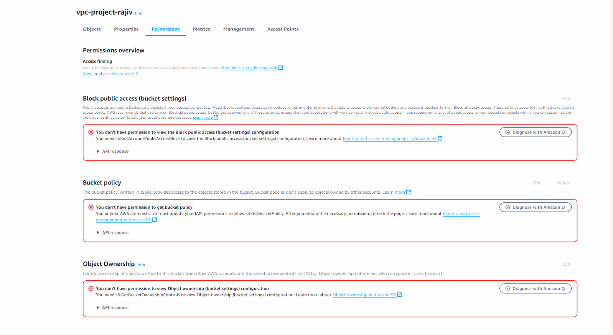
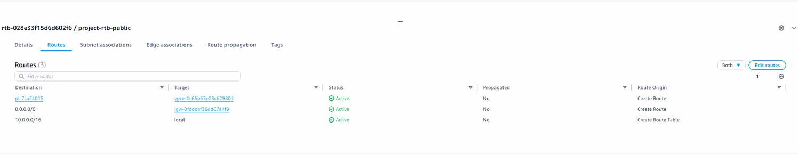

# Private S3 Access Using a VPC Endpoint

## Overview

This project demonstrates how to access Amazon S3 privately from an EC2 instance using a **VPC Endpoint**, eliminating the need for internet-based access.

The objective was to understand how VPC Endpoints work, how route tables direct traffic to AWS services, and how **bucket policies and endpoint policies** can be used to enforce secure access.

The project also involved troubleshooting access issues caused by policy restrictions and validating that S3 access was only permitted through the VPC Endpoint.

---

## Architecture

The architecture consists of:

- **Amazon VPC**
- **Public subnet**
- **EC2 instance**
- **Amazon S3 bucket**
- **S3 Gateway VPC Endpoint**
- **Route table (S3 prefix → VPC Endpoint)**
- **Bucket policy restricting access to the endpoint**

The EC2 instance accesses S3 through the VPC Endpoint rather than through the public internet.

The diagram below illustrates how S3 traffic is routed through the VPC Endpoint rather than the Internet Gateway.



---

## Implementation Steps

### Verify Initial S3 Access

The EC2 instance was already configured with AWS CLI credentials using `aws configure`.

S3 access was tested using:

```bash
aws s3 ls

---

### Create a VPC Endpoint

A **Gateway VPC Endpoint** for Amazon S3 was created to establish a private connection between the VPC and S3.

---

### Apply Bucket Policy Restriction

A bucket policy was configured to deny access unless requests originated from the VPC Endpoint.

This immediately restricted access to the S3 bucket.

---

### Test Access After Restriction

After applying the policy, S3 access was tested again and access issues were observed.

This confirmed that the policy was actively enforcing access restrictions.

---

### Update Route Table

The route table was updated to include the S3 prefix list:

```text
pl-xxxx → VPC Endpoint
```

This ensured that S3 traffic was routed through the VPC Endpoint.

---

### Verify Access via Endpoint

S3 access was tested again:

```bash
aws s3 ls s3://vpc-project-rajiv

Access was successful, confirming that traffic was now correctly routed through the VPC Endpoint.

````

---

## Skills Demonstrated

* VPC Endpoint configuration (Gateway endpoint)
* Private AWS service access design
* Route table configuration using prefix lists
* S3 bucket policy enforcement
* Troubleshooting IAM and access control issues
* Secure architecture design (no public S3 exposure)

---

## Screenshots

### Initial S3 Access from EC2



### Viewing Bucket Contents



### Creating VPC Endpoint



### Bucket Policy Restriction



### Permission Errors (Policy Enforcement)



### Route Table Update

