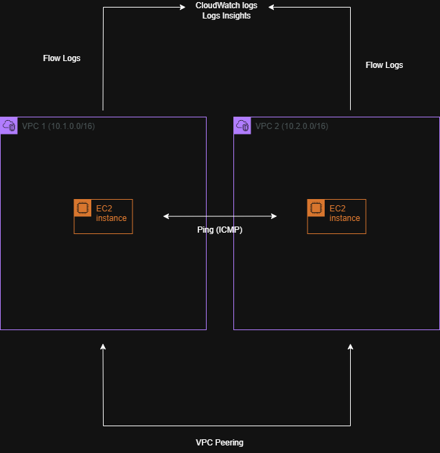
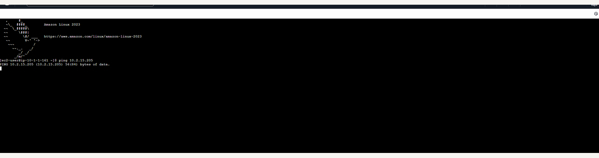
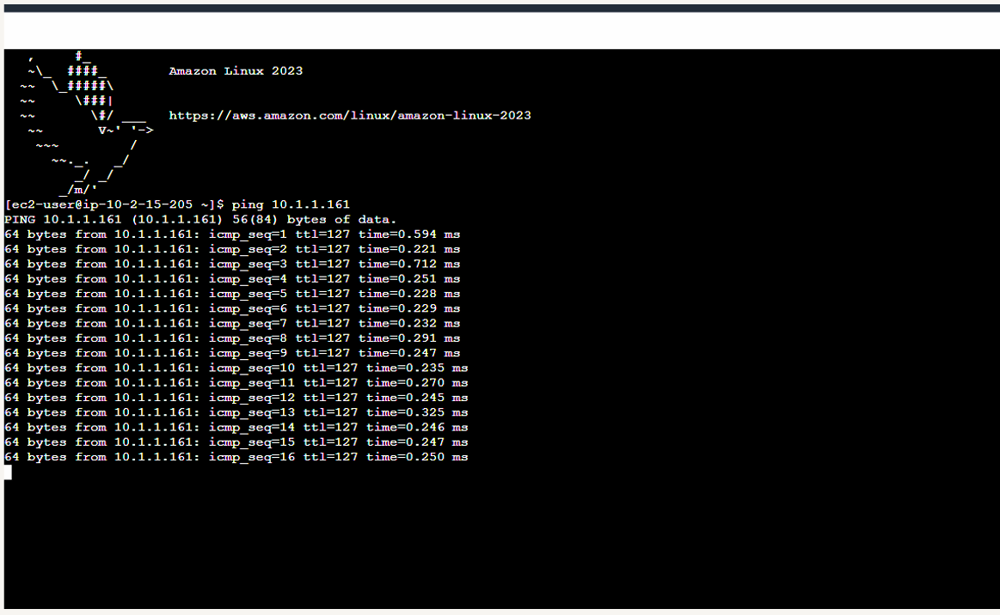
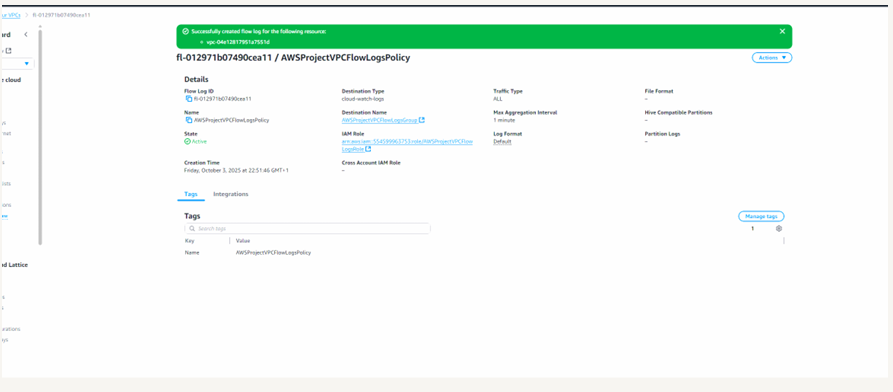
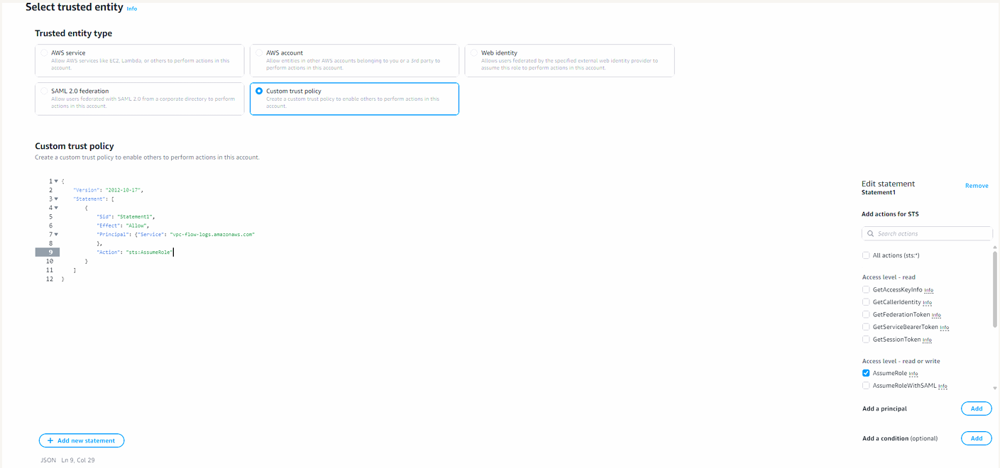
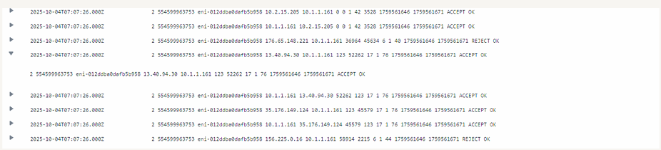
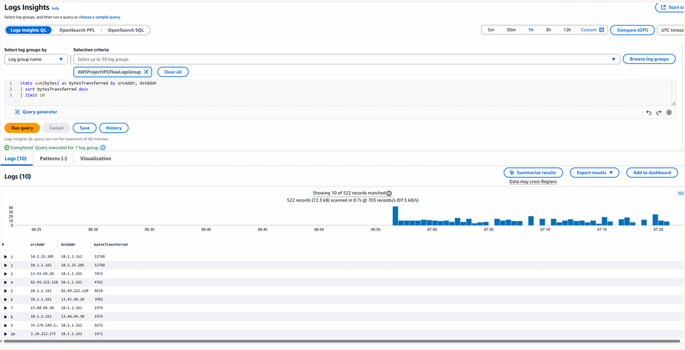

# VPC Monitoring with Flow Logs

## Overview

This project demonstrates how to monitor and analyze network traffic within an Amazon VPC using **VPC Flow Logs** and **CloudWatch Logs Insights**.

The objective was to capture network traffic metadata, troubleshoot connectivity issues between EC2 instances, and gain visibility into traffic patterns within a multi-VPC architecture.

VPC Flow Logs record **metadata (not packet contents)**, including source/destination IPs, ports, protocols, and whether traffic was accepted or rejected.

---

## Architecture

The architecture consists of:

* **Two Amazon VPCs**
* **Public subnets in each VPC**
* **EC2 instances in each subnet**
* **VPC peering connection**
* **VPC Flow Logs**
* **CloudWatch Log Group**
* **IAM role for Flow Logs**

Traffic between EC2 instances is monitored using Flow Logs and analyzed using CloudWatch Logs Insights.

## VPC Architecture



---

## Implementation Steps

### Create VPCs and Launch EC2 Instances

Two VPCs were created with non-overlapping CIDR ranges.
Each VPC contained a public subnet with an EC2 instance.

---

### Configure VPC Flow Logs

Flow Logs were enabled at the VPC level to capture all network traffic.

An IAM role was created and assigned to allow Flow Logs to publish data to CloudWatch.

---

### Generate Network Traffic

A connectivity test was performed between EC2 instances using private IP addresses:

```bash
ping <private-ip>
```

---

### Troubleshoot Connectivity

The initial ping test failed, indicating a connectivity issue.

The root cause was identified as missing routing between the VPCs.

---

### Configure VPC Peering and Route Tables

A VPC peering connection was established between the two VPCs.

Route tables were updated to allow traffic between both CIDR ranges.

---

### Verify Connectivity

After updating the route tables, the ping test was successful, confirming proper communication between the VPCs.

---

### Analyze Flow Logs

Flow Logs were reviewed in CloudWatch to observe network activity.

Log entries provided:

* Source and destination IP addresses
* Ports and protocols
* ACCEPT / REJECT traffic decisions
* Traffic volume (bytes and packets)

---

### Query Logs with CloudWatch Logs Insights

A query was executed to identify the most active traffic flows:

```sql
stats sum(bytes) as bytesTransferred by srcAddr, dstAddr
| sort bytesTransferred desc
| limit 10
```

This highlighted the highest-volume communication paths between instances.

---

## Skills Demonstrated

* VPC Flow Logs configuration
* IAM roles and trust policies
* Network troubleshooting and root cause analysis
* VPC peering and route configuration
* CloudWatch Logs analysis
* Logs Insights querying
* Traffic pattern analysis

---

## Screenshots

### Failed Connectivity Test



### Successful Connectivity Test



### VPC Flow Logs Configuration



### IAM Role and Trust Policy



### Flow Log Entries (ACCEPT / REJECT)



### Logs Insights Query Results


